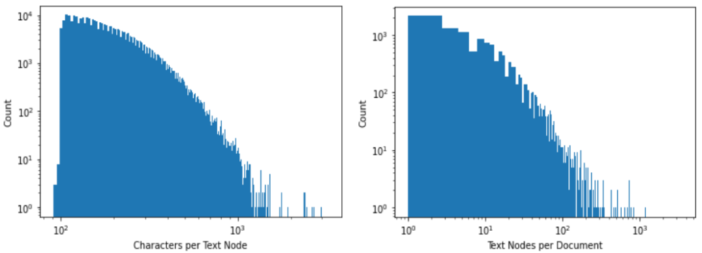
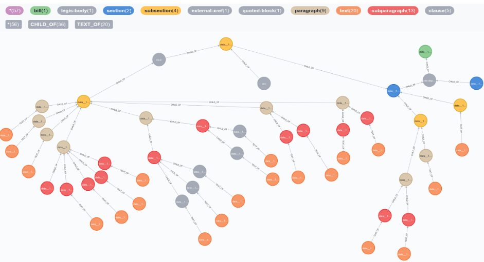

## Identifying Similar Legislation
### CS 6120 Natural Language Processing -- 29 APR 2021 

For this project I worked backward toward answering a natural language question. I had many tools and methods I wanted to try out but was initially unsure of which question to answer. I also wanted to work on a corpus that was not pre-processed into a dataset. I decided on an information retrieval task based on document similarity. Given a piece of US Federal legislation I would try to find relevant related legislation.

Legislation is a challenging domain due to the sometimes arcane jargon, repetitive formal structure and phrases, and the many topics that can be contained within a document. Since I was working with the raw legislation, I also focused on methods that could work in an unsupervised manner, without manual annotation.

The U.S. Government Publishing Office (GPO) provides the text of congressional bills online. There is an open source project [on Github](https://github.com/unitedstates/congress) with a collection of congressional data scrapers. I used the bill text downloader to collect the text and XML versions of bills from the 115th congress. I first tried arbitrarily dividing plain text bills into fixed length strings, but found that these partitions would merge adjacent unrelated sections which often discuss different topics. I also tried parsing the structure of the plain text based on alphanumeric section tags before realizing that there was the XML annotated version.

Parsing the XML version instead made it easier to break the document into mostly single topic paragraphs and to discard headings, tables of figures, etc. While parsing each document to collect paragraph text, I saved the tree structure connecting the paragraph ids to a Neo4j graph database. I also saved each document creation date. I only used one version of each bill to avoid adding too much duplicated text. This resulted in 11M words from 359,000 paragraphs in 13,357 bills. 




				Figure 1: Histogram of corpus

I attempted to use an open source [tool](https://github.com/srdc/ontmalizer) for converting XML to RDF/OWL representation. Inspired by the [Financial Regulation Ontology](https://finregont.com/tutorial-chapter2-load-law/), I hoped this could facilitate more complex reasoning about document representations. [United States Legislative Markup](https://github.com/usgpo/uslm) is a formal schema definition for representing legislative documents. Unfortunately, this schema is not universally applied across congressional documents. I was not able to set up a pipeline that could convert to RDF automatically, so didn’t pursue this idea further. Instead, I captured only a simple tree structure connecting paragraph text which were the leaves of the tree. 



 
			Figure 2: An example of one document tree

Given this graph, I now looked at algorithms for recommending related documents given a query document. The Library of Congress provides some listings of related bills on their website. They define a related bill as:  \
   “a [companion measure](https://www.congress.gov/help/legislative-glossary/#glossary_companionmeasure), an [identical bill](https://www.congress.gov/help/legislative-glossary/#glossary_identicalbill), a [procedurally-related measure](https://www.congress.gov/help/legislative-glossary/#glossary_procedurallyrelatedmeasure), or one with \
    [text similarities](https://www.congress.gov/help/legislative-glossary/#glossary_textsimilarities) … and refer only to same-Congress measures.” \
Unfortunately, the related documents specified by the Library of Congress are not always the best. I found some complaints on the congress github about their quality and it is not clear why a document was selected from among the defined reasons. 

Instead of scraping the LOC related documents, I used the [passim](https://github.com/dasmiq/passim) project as a benchmark method of identifying similarity between documents. This tool quickly finds exact text matches between documents in a corpus and can calculate an alignment to show which words were dropped or inserted between two matching sequences. I specified paragraphs from within the same document as a series, so that they would not be aligned to each other. I used the creation date of the bill to determine direction and found all pairwise alignments between paragraphs. 

I then loaded each alignment as an edge connecting paragraph nodes in the Neo4j graph. Ranking the number of edges (aligned paragraphs) between documents works well for finding bills related to large omnibus legislation. For example, Senate S1 has 30 related bills listed by the Library of Congress. Of the top 30 bills ranked by alignments, 10 are on the related bills list. Most bills in the corpus don’t share exact text matches though and also don’t necessarily have related bills listed online. So although this served as a good baseline, the approach has limitations when it comes to the document retrieval task. 

To try to overcome these limitations, I tried several language models. Using the results from passim, I made a list of aligned paragraphs for each paragraph in the corpus. For each model I checked to see how many of the aligned paragraphs would be found when ranking all paragraphs by cosine similarity. If there were **n** alignments for a given paragraph I only took the top **n** cosine similarities. I used this as a measure of accuracy for the models.

I found that tokenizing using the NLTK word tokenizer and using legal domain specific stopwords from [LexNLP](https://github.com/LexPredict/lexpredict-lexnlp) worked well across models. I tried a [TF-IDF model](https://radimrehurek.com/gensim/models/tfidfmodel.html) and the Paragraph Vector - Distributed Memory (PV-DM) and Distributed Bag of Words (PV-BOW) versions of the [Doc2Vec](https://radimrehurek.com/gensim/auto_examples/tutorials/run_doc2vec_lee.html) model. The PV-DBOW model was the most accurate at finding aligned paragraphs.


<table>
  <tr>
   <td rowspan="2" >
   </td>
   <td rowspan="2" > 
Accuracy
   </td>
   <td colspan="3" >Cosine Similarity of Matches
   </td>
  </tr>
  <tr>
   <td>Avg
   </td>
   <td>Min
   </td>
   <td>Max
   </td>
  </tr>
  <tr>
   <td>TF-IDF
   </td>
   <td>0.63
   </td>
   <td>0.77
   </td>
   <td>0.22
   </td>
   <td>0.99
   </td>
  </tr>
  <tr>
   <td>PV-DM 
   </td>
   <td>0.64
   </td>
   <td>0.55
   </td>
   <td>0.49
   </td>
   <td>0.97
   </td>
  </tr>
  <tr>
   <td>PV-DBOW
   </td>
   <td>0.78
   </td>
   <td>0.91
   </td>
   <td>0.49
   </td>
   <td>0.99
   </td>
  </tr>
</table>


	

In addition to having high accuracy, the PV-DBOW model also had high cosine similarity values for the paragraphs identified by passim as having exact text alignments. This means I can set a high threshold for cosine similarity when looking for related paragraphs and still be confident that most of the desired matches will be included. Since I’m now including non-exact matches, I don’t want to capture too many noisy results. 

In regards to the task of finding related documents with the PV-DBOW model we can look again at the 30 Senate S1 related bills. For each paragraph in S1 I look for up to 10 paragraphs with greater than 0.9 cosine similarity. I aggregate these paragraph scores by bill and take the top 30 bills. This approach finds the same 10 bills found by ranking with passim alignments. Compared to the top 30 documents with most alignments, 19 are ranked similarly between the passim alignments and the PV-DBOW model. Looking at the text of the matches, the results appear to be relevant even for non-exact matches (see Appendix A).

The results I found were unexpected, since the PV-DM model performed better for all tasks in the original Paragraph Vector paper by Le & Milikov. However, the tasks in that paper were supervised classification tasks. The simpler PV-DBOW model which disregards word order is actually an advantage for this task of finding partial matches between paragraphs. Comparing vector representations of paragraphs is an efficient method of quickly finding similar documents and is less computationally expensive to query than performing an alignment of paragraphs across the full corpus. I hope to also find interesting relationships by exploring the vector space of the model.

I looked at Personalized PageRank as another way to propagate the importance of documents through the graph for those that aren’t immediately connected to the query document. This did not work well, I think because the algorithm is designed for directed graphs. “Relatedness” is necessarily bidirectional. The document rankings created did not match well with any of the other methods I tried for comparison. But it might be helpful as a re-ranking method after finding a batch of related documents, or if the graph has more kinds of relationships.

One additional type of annotation I investigated, but wasn’t able to implement was references to other legislation. The XML of the US Code contains actual hyperlinks when other documents are referenced, that would make it possible to add those explicit relationships to the graph of documents. However, congressional bills do not have hyperlinks. Those references would need to be parsed from the text of the paragraphs. Often, the references are specified relative to a document stated once at the beginning of a section. So it would be necessary to recognize an incomplete reference and search up the tree for the referring document. Also, the nodes of the graph would need to be labeled such that the references could be resolved to a destination. This is my goal for future work.


References:

Bird, Steven, Edward Loper and Ewan Klein (2009), Natural Language Processing with Python. O’Reilly Media Inc.

Hodler, Amy, and Mark Needham (2019), Graph Algorithms. O’Reilly Media Inc.

Le, Q., & Mikolov, T. (2014, June). Distributed representations of sentences and documents. In International conference on machine learning (pp. 1188-1196). PMLR.

Linder, F., Desmarais, B., Burgess, M., & Giraudy, E. (2020). Text as Policy: Measuring Policy Similarity through Bill Text Reuse. Policy Studies Journal, 48, 546-574.

Mikolov, T., Chen, K., Corrado, G., & Dean, J. (2013). Efficient estimation of word representations in vector space. arXiv preprint arXiv:1301.3781.

Wilkerson, J., Smith, D. and Stramp, N. (2015), Tracing the Flow of Policy Ideas in Legislatures: A Text Reuse Approach. American Journal of Political Science, 59: 943-956. [https://doi.org/10.1111/ajps.12175](https://doi.org/10.1111/ajps.12175)


Appendix A


```
Query Paragraph:
['data__115__bills__s__s1_51_247', 'In determining the amount of tax imposed by this section for the taxable year on a child described in subparagraph (A), the income tax table otherwise applicable under this subsection to the child shall be applied with the following modifications:', '2017-11-28']
---------------------------------------------------------------------------------------
'data__115__bills__hr__hr6760_71_218 0.8978298  In determining the amount of tax imposed by this section for the taxable year on such child, the income tax table otherwise applicable under this section to such child shall be applied with the following modifications:',
'data__115__bills__s__s2281_93_124 0.868156671  The income tax table otherwise applicable under this section to the child shall be applied with the following modifications:',
'data__115__bills__s__s2687_93_124 0.847423315  The income tax table otherwise applicable under this section to the child shall be applied with the following modifications:',
'data__115__bills__s__s2291_93_124 0.843777358  The income tax table otherwise applicable under this section to the child shall be applied with the following modifications:',
'data__115__bills__hr__hr2267_31_193 0.7848389  For purposes of determining an increase in the otherwise applicable resident limit under subparagraph (A) (other than such an increase described in subparagraph (B)), the following shall apply:',
'data__115__bills__s__s2198_34_103 0.743726730  The amount of tax imposed by subsection (a) shall be determined in accordance with the following table:',
'data__115__bills__hr__hr35_19_614 0.734501600  For purposes of this section, except as otherwise provided in this subsection, a child health savings account established for the benefit of the child of a taxpayer shall be treated as a health savings account of the taxpayer until the first taxable year (and each taxable year thereafter) for which no deduction under section 151 is allowable to any taxpayer with respect to such child, after which such account shall be treated as a health savings account of the child. The preceding sentence shall not apply for purposes of applying the limitations in subsection (b) to a health savings account of the taxpayer.',
'data__115__bills__hr__hr1531_44_107 0.7292989  The amount of the tax imposed by subsection (a) shall be determined in accordance with the following table:',
'data__115__bills__hr__hr1040_55_195 0.7277489  In the case of any taxable year beginning in a calendar year after 2018, each dollar amount contained in subsection (c) shall be increased by an amount determined by the Secretary to be equal to—',
'data__115__bills__s__s2718_39_205 0.727592229  In applying subsection (a) for any taxable year to which this paragraph applies, only the itemized deductions described in subparagraph (A) shall be taken into account as miscellaneous itemized deductions.'
